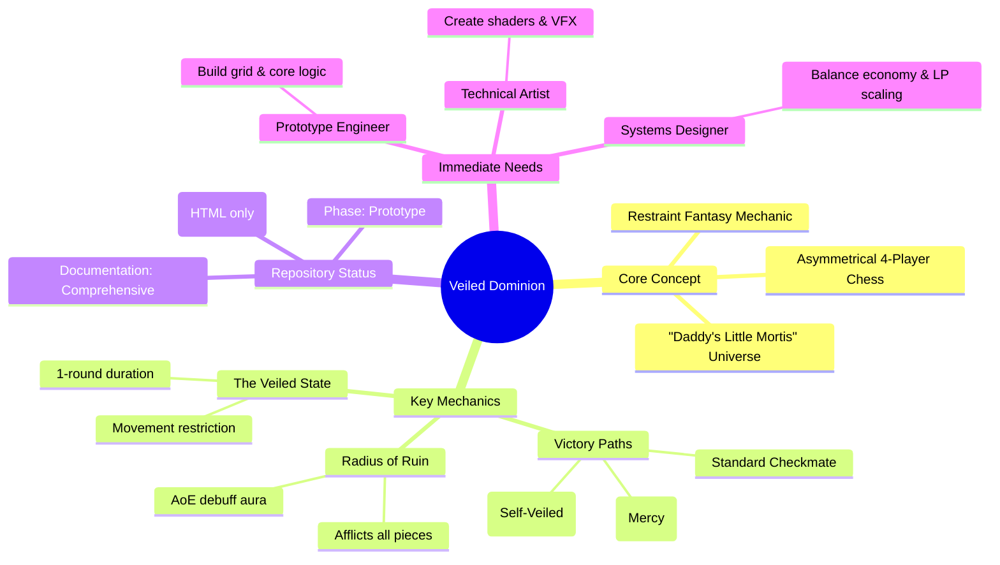
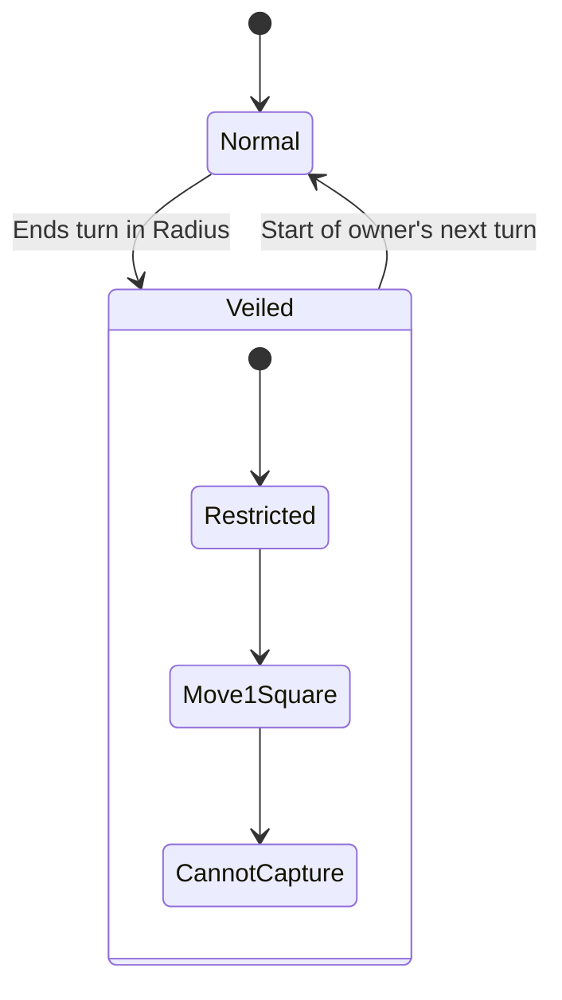

### **Game Analysis & Contribution Guide: Veiled Dominion Engine**

# ♟️ Veiled Dominion - Game Analysis & Contribution Guide

## 📋 Executive Summary
**Veiled Dominion** is an ambitious 4-player, asymmetrical chess variant that introduces a "Restraint Fantasy" mechanic, where one player wins by *not* using their power. The project is currently in the **Prototype Phase**, with detailed design documentation but minimal code implementation 【turn0fetch0】. This document provides a structured analysis of the game's core systems, repository status, and a roadmap for contributors.



## 🎯 Game Overview

### **Core Thesis & Innovation**
The game subverts the traditional power fantasy by creating a "Restraint Fantasy" 【turn0fetch0】:
- **Traditional Model**: Start weak → Gain power → Win by dominance
- **Veiled Dominion Model**: Start overpowered → Win by not using power → The board is your victim, not your enemy

This creates a unique psychological tension where the most powerful player must exercise restraint to win, while other players must survive or exploit her mistakes.

### **Asymmetrical Faction Design**
| Faction | Role | Unique Challenge |
|---------|------|------------------|
| **Rebirth** | Overpowered learner | Must master restraint and earn Leadership Points through merciful maneuvers |
| **Mortal Factions (x3)** | Survivalists | Must cooperate or compete to survive Rebirth's aura or checkmate her |

## ⚙️ Core Mechanics Analysis

### **The Radius of Ruin (AoE System)**
This is the game's signature mechanic and primary technical challenge for implementation.
- **Trigger**: Rebirth emits a 1-square aura (8 adjacent squares) 【turn0fetch0】
- **Effect**: Any piece (friendly or enemy, except Death/Rebirth) ending its turn within this radius enters the **Veiled** state
- **Strategic Depth**: Rebirth can accidentally suppress her own allies, creating internal conflict

### **The Veiled State (Debuff System)**
A state machine that restricts piece capabilities:

- **Duration**: Exactly 1 full round 【turn0fetch0】
- **Effects**: Loses all special movement, can only move 1 square forward, cannot capture
- **Technical Note**: Does not stack; entering the radius refreshes duration

### **Victory Condition Matrix**
The game features three distinct end-states, requiring careful balance:

| Victory Type | Achieved By | Technical Implementation Priority |
|--------------|-------------|-----------------------------------|
| **Standard Checkmate** | Any player's Leader is checkmated | High (Core chess logic) |
| **Rebirth Wins (Leadership/Mercy)** | Rebirth accumulates 10 Leadership Points through: Withdrawal, Shielding, Coexistence | Medium (LP tracking system) |
| **Mortals Win (The Fall)** | Rebirth accidentally "Veils" 5 of her own pieces | High (State tracking & counter) |

## 🏗️ Repository Structure & Technical Assessment

### **Current Implementation Status**
```
/veiled-dominion (Current State)
├── /docs (Empty - Planned)
│   ├── QUEENS_JOURNEY.md (Planned)
│   └── PITCH_DECK.md (Planned)
├── /src (Empty - Planned)
│   ├── /board (14x14 cross-grid topology)
│   ├── /pieces (Base piece classes)
│   ├── /systems (Radius of Ruin, Veil state machine)
│   └── /input (Turn phase management)
├── /assets (Empty - Planned)
│   ├── /models (3D models, shaders)
│   └── /audio (Ambient SFX, cues)
├── index.html (Only actual code file)
├── README.md (Comprehensive design doc)
└── LICENSE.md (CC BY-NC-SA 4.0)
```

### **Technical Debt & Challenges**
1. **Grid Topology**: 14×14 cross-shaped grid with 2×2 neutral center requires custom coordinate logic
2. **AoE Calculations**: Radius of Ruin needs efficient spatial querying for 4 players
3. **State Synchronization**: Asynchronous 4-player turn structure with persistent states (Veiled, LP counters)
4. **Shader Requirements**: Death (light absorption/void) and Rebirth (internal refraction/glow) need custom shaders

## 🤝 Contribution Roadmap

### **Immediate Priority Areas**
<details>
<summary>🔧 Technical Implementation Phases</summary>

#### **Phase 1: Core Prototype (2-3 months)**
- [ ] Implement 14×14 cross-shaped grid with coordinate system
- [ ] Create base piece classes with locomotion rules
- [ ] Develop `RadiusOfRuin.cs` state machine
- [ ] Basic turn structure loop for 4 players
- [ ] Simple UI for piece selection and movement validation

#### **Phase 2: Systems Integration (3-4 months)**
- [ ] Implement Veiled state system with duration tracking
- [ ] Leadership Point (LP) tracking and accumulation logic
- [ ] Martyr's Boon economy system
- [ ] Victory condition evaluation for all three paths
- [ ] Basic AI for testing (optional but recommended)

#### **Phase 3: Visual & Audio Polish (2-3 months)**
- [ ] Death shader (light absorption/Musou Black effect)
- [ ] Rebirth shader (translucent/internal refraction)
- [ ] Ambient audio system for state changes
- [ ] VFX for Radius of Ruin visualization
- [ ] 3D model integration for all pieces
</details>

### **Skill Requirements by Task**
| Role | Key Skills | Estimated Effort | Priority |
|------|------------|------------------|----------|
| **Prototype Engineer** | C#/C++, spatial algorithms, state machines, multiplayer networking | 200-300 hours | Critical |
| **Technical Artist** | Shader programming (HLSL/GLSL), 3D modeling, VFX systems | 100-150 hours | High |
| **Systems Designer** | Game balancing, economy design, mathematical modeling, testing | 80-120 hours | Medium |
| **UI/UX Developer** | Unity/Unreal UI, 4-player interface design, accessibility | 60-80 hours | Medium |

## 📁 Recommended Documentation Structure
Based on best practices for game repositories 【turn0search2】【turn0search3】【turn0search11】, create the following documentation hierarchy:

```
/docs
├── /design
│   ├── GDD.md (Game Design Document - this analysis)
│   ├── MECHANICS.md (Detailed mechanical breakdowns)
│   ├── BALANCE.md (Economy balancing notes and simulations)
│   └── WORLD_LORE.md (Thematic elements from QUEENS_JOURNEY.md)
├── /technical
│   ├── ARCHITECTURE.md (System design and data flow)
│   ├── API.md (If exposing any interfaces)
│   └── PERFORMANCE.md (Optimization considerations)
├── /art
│   ├── STYLE_GUIDE.md (Visual consistency guidelines)
│   ├── SHADER_SPECS.md (Technical requirements for shaders)
│   └── ASSET_LIST.md (Required 3D models, textures, audio)
├── /contributing
│   ├── ONBOARDING.md (Step-by-step setup guide)
│   ├── WORKFLOW.md (Branching strategy, PR process)
│   └── STANDARDS.md (Code style, naming conventions)
└── /marketing
    ├── PITCH_DECK.md (For investors/publishers)
    ├── PRESS_KIT.md (For media/coverage)
    └── ROADMAP.md (Public development timeline)
```

### **For Potential Contributors:**
1. **Fork the repository** and create feature branches
2. **Start with Phase 1 tasks** (grid implementation, basic movement)
3. **Use the Discord/Matrix channels** mentioned in search results for real-time collaboration 【turn0search1】
4. **Document all mechanical changes** in this GDD first (as per contribution guidelines)
5. **Include portfolio links** when applying via email (questions@loptrlab.com)

## 📊 Success Metrics & Next Steps

### **Prototype Success Criteria:**
- [ ] 4 players can connect and play asynchronously
- [ ] All core mechanics (Radius, Veiled, LP) function correctly
- [ ] Victory conditions trigger properly for all three paths
- [ ] Basic UI provides necessary game state information
- [ ] Performance remains stable with all pieces on board

### **Post-Prototype Goals:**
1. **Playtest with 4 players** to balance LP economy
2. **Iterate on shader effects** for Death and Rebirth
3. **Develop AI opponents** for solo testing
4. **Create physical prototype** for tabletop testing
5. **Prepare pitch materials** for potential funding/publishing

#### **Supporting Documentation:**
```
/docs
├── /design
│   ├── GDD.md (This document)
│   ├── MECHANICS.md (Detailed mechanical breakdowns)
│   └── WORLD_LORE.md (Thematic elements)
├── /technical
│   ├── ARCHITECTURE.md (System design diagrams)
│   └── API.md (If applicable)
├── /contributing
│   ├── ONBOARDING.md (Setup guide)
│   └── WORKFLOW.md (Development process)
└── /assets
    └── ASSET_LIST.md (Required art/audio)
```

This structure follows GitHub's documentation best practices 【turn0search3】 and the patterns seen in successful game repositories 【turn0search2】, while providing clear pathways for contributors to find information and get involved with the project.
